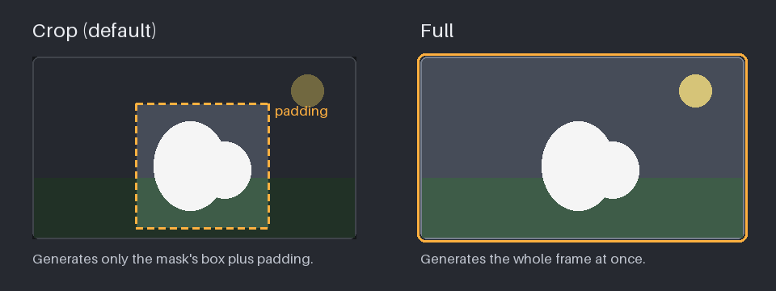

### Mask crop mode

- **Crop** (default) cuts the source and mask down to the mask's bounding box,
  plus some padding, before generating. The model spends all of its resolution
  on the area you are changing, which gives the most detail for small edits.
- **Full** generates the whole frame. Use it when the mask covers most of the
  frame, or when the edit depends on seeing the whole scene.

**Mask crop padding** adds a margin of surrounding footage around the mask's
box in crop mode. More padding gives the model more context to blend the edit
in; less keeps more resolution for the masked area itself.

> **Prompting a cropped inpaint:** describe only what falls inside the
> *cropped* area — the mask's box plus its padding — because that is all the
> model sees. In crop mode, that area is the "whole clip" to describe.
